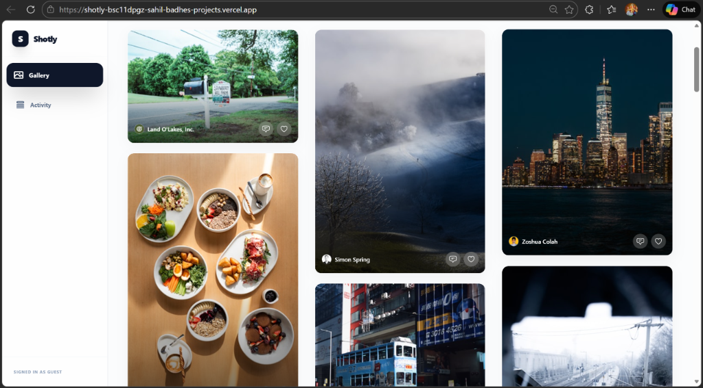
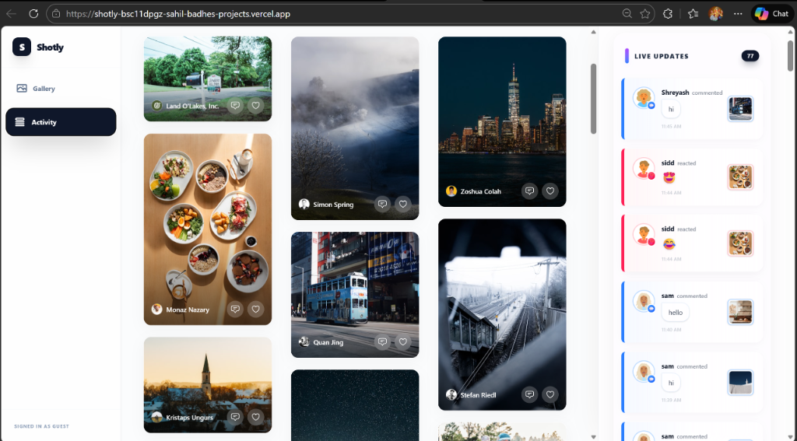

# 📸 Shotly - Real-Time Photo Gallery & Activity Feed

Shotly is a premium, high-performance photo gallery application built with React, Vite, and InstantDB. It features a stunning masonry grid layout, real-time activity updates, and a seamless user experience designed to showcase visual content beautifully.



## ✨ Features

- **Dynamic Masonry Layout**: A fluid and responsive grid that adapts to any screen size, providing a premium feel for image browsing.
- **Real-Time Activity Feed**: Stay updated with live comments, reactions, and interactions as they happen.
- **Interactive Image Modals**: View images in high resolution with integrated social features.
- **Micro-Animations**: Powered by **Framer Motion** for smooth transitions and a modern UI feel.
- **Authentication Gate**: Smart user identity management for interactive features.
- **InstantDB Integration**: Leveraging real-time graph database capabilities for lightning-fast synchronization.



## 🛠️ Tech Stack

- **Frontend**: React 19 (Vite)
- **Styling**: Tailwind CSS 4.0
- **Animations**: Framer Motion
- **Database/Real-time**: [InstantDB](https://www.instantdb.com/)
- **State Management**: TanStack React Query

## 🚀 Getting Started

### Prerequisites

- Node.js (v18 or higher)
- npm or yarn

### Installation

1. **Clone the repository**:
   ```bash
   git clone https://github.com/sahil-badhe/Photos-gallery.git
   cd Photos-gallery
   ```

2. **Install dependencies**:
   ```bash
   npm install
   ```

3. **Set up Environment Variables**:
   Create a `.env` file in the root directory and add your InstantDB App ID:
   ```env
   VITE_INSTANT_APP_ID=your_app_id_here
   ```

4. **Run the development server**:
   ```bash
   npm run dev
   ```

## 📱 UI Previews

````carousel

<!-- slide -->

````

## 📄 License

This project is licensed under the MIT License - see the LICENSE file for details.

---

Built with ❤️ by [Sahil Badhe](https://github.com/sahil-badhe)
